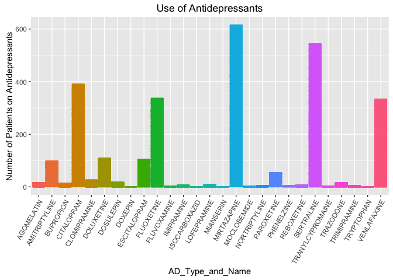
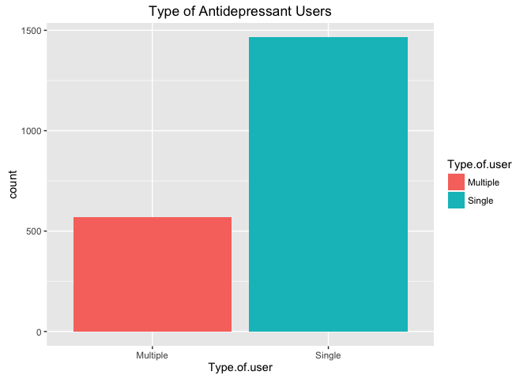
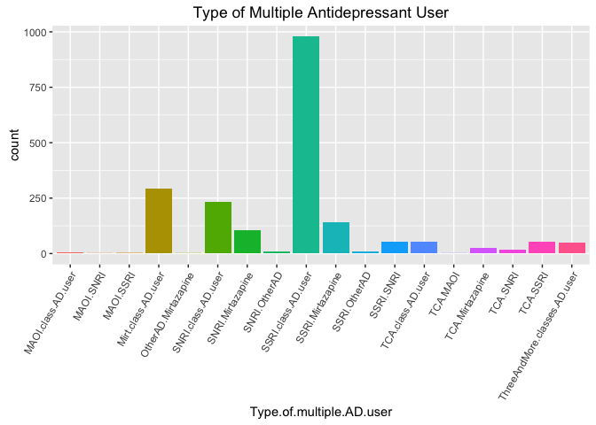
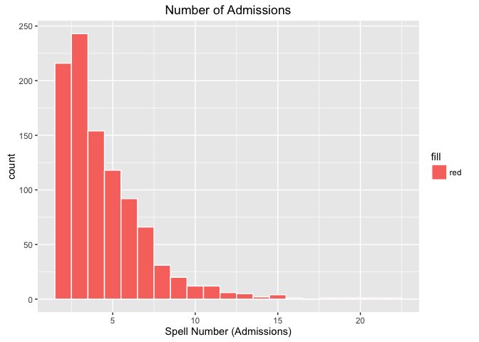

# EDA Problem Set 5: EDA
andreafernandes  
9 April 2016  

******

###Introduction and Background for Gapminder Problem Set 5 Exercise


```r
# https://www.udacity.com/course/viewer#!/c-ud651/l-770038733/e-867869590/m-901058638

# The Gapminder website contains over 500 data sets with information about
# the world's population. Your task is to continue the investigation you did at the
# end of Problem Set 4 or you can start fresh and choose a different
# data set from Gapminder.

# If you’re feeling adventurous or want to try some data munging see if you can
# find a data set or scrape one from the web.

# In your investigation, examine 3 or more variables and create 2-5 plots that make
# use of the techniques from Lesson 5.

# You can find a link to the Gapminder website in the Instructor Notes.

# Once you've completed your investigation, create a post in the discussions that includes:
#       1. the variable(s) you investigated, your observations, and any summary statistics
#       2. snippets of code that created the plots
#       3. links to the images of your plots

# Copy and paste all of the code that you used for
# your investigation, and submit it when you are ready.
# ============================================================================================
```


******

###My "Gapminder" project Aims and Objectives using the Antidepressant Dataset

####**Part 1: Antidepressant Use in Secondary Mental Health Care Patients** 

The aim of this part of the project is to understand how antidepressants are used among depressed patients in this secondary mental health care setting. In other words, what are the common prescriptions of antidepressants in this secondary mental health care facility? How are antidepressants prescribed? Is the entire cohort receiving antidepressant treatment?

####**Part 2: Comparing Antidepressant users to Non antidepressant users**

All patients in this cohort have a diagnosis of depression. About half the individuals in this cohort are not on any antidepressants during the snapshot. Are there any differences in the patients using antidepressants compared to patients not using antidepressants?

####**Part 3: Antidepressant Use and Suicide Attempt**

There is some indication that one of the side-effects of antidepressant use is suicidality (i.e. suicidal ideation, suicdie attempt or death by suicide) [ref]. Conducting preliminary analysis, is there any indication that use of antidepressant may be associated with suicide attempts? 

******

******
###THE DATASET

**Description of the Antidepressant dataset.**

The dataset used here is a 6 month snapshot of antidepressant use among mental health patients with a clinical diagnosis of depression. 

**Data Source**

The data is derived from a mental health clinical trust based in South London and covers an area with a population of around 1.4 million residents. The trust provides secondary mental health care to individuals who are referred by GPs, privately referred, A&E and self-referrals.

In 2008, a research facility was founded which used pseudonymised the electronic clinical records from the South London trust for research and clinical audit purposes. Currently there are ~250000 records within this research database. Within the database, there are around 70000 individuals with a clinical diagnosis of dperession, who were known to the trust (comorbid depression included). 

**The Sample**

To investigate or explore AntiDepressant (AD) use I selected individuals who met both of the following criteria:

|_Inclusion Criteria_|
|:-------|
| 1) Patient had a clinical diagnosis of dpression but no other major mental disorder (such as schizophrenia, bipolar disorder etc)|
| 2) Patient had some face to face contact with clinical staff at some point during the 1st of March 2014 to 31st August 2014. |

******

The sample consisted of 4157 patients. 

*******

*******

|_**Acronym Key**_|  |
|:-------|:-------|
|AD | AntiDepressant |
|Snapshot period | Randomly selected 6 month period from 1st of March, 2014 to the 31st of August, 2014|
|LSOA code | Lower Super Output Area code (it's an area level address code) |
|TCA | Antidepressant class: TriCyclic Antidepressants|
|MAOI | Antidepressant class: Mono Amine Oxidase Inhibitors |
|SSRI | Antidepressant class: Selective Serotonin Reuptake Inhibitors|
|SNRI | Antidepressant class: Selective Norepinephrine Reuptake Inhibitors|


******


******

******

###Part 1: ANTIDEPRESSANT USE


******

The plot above shows the number of patients within each antidepressant prescribed at the Trust. The tables below provide the corresponding numbers.

******

**Number of patients on each antidepressant.**

AD_Type_and_Name   count 
-----------------  ------
DOXEPIN            1     
MIANSERIN          1     
FLUVOXAMINE        3     
MOCLOBEMIDE        3     
TRANYLCYPROMAINE   3     
NORTRIPTYLINE      4     
PHENELZINE         4     
TRIMIPRAMINE       4     
IMIPRAMINE         6     
REBOXETINE         6     
LOFEPRAMINE        9     
BUPROPION          14    
AGOMELATIN         16    
TRAZODONE          16    
DOSULEPIN          18    
CLOMIPRAMINE       26    
PAROXETINE         54    
AMITRIPTYLINE      99    
ESCITALOPRAM       104   
DOLUXETINE         109   
VENLAFAXINE        333   
FLUOXETINE         337   
CITALOPRAM         391   
SERTRALINE         544   
MIRTAZAPINE        616   

___What's the most common antidepressant prescribed?___

      - Mirtazapine, an atypical antidepressant with noradrenergic and specific serotonergic activity, is the 
      
        MOST COMMONLY prescribed / used antidepressant within the 6-month snapshot period. 
      
      - Followed by SSRI Sertraline, SSRI Citalopram, SNRI Venlafaxine and SSRI Fluoxetine.

******


*****

####Type of Antidepressant Users

Are patients being prescribed single antidepressant drugs or in combination?

******




******

Antidepressants are most commonly prescribed as single antidepressants.

******



******

Patients who are prescribed multiple antidepressants get prescribed different classes of antidepressants as opposed to antidepressants within the same class (e.g. SSRI in combination with an SNRI as opposed to another SSRI).

*******

Here's corresponding numbers to the graphs above. 

####**Most Common Multiple Antidepressant user groups**               

Type.of.multiple.AD.user       count 
-----------------------------  ------
MAOI.SNRI                      1     
OtherAD.Mirtazapine            1     
TCA.MAOI                       1     
MAOI.SSRI                      2     
MAOI.class.AD.user             6     
SNRI.OtherAD                   9     
SSRI.OtherAD                   10    
TCA.SNRI                       18    
TCA.Mirtazapine                25    
ThreeAndMore.classes.AD.user   50    
TCA.SSRI                       53    
SSRI.SNRI                      54    
TCA.class.AD.user              55    
SNRI.Mirtazapine               104   
SSRI.Mirtazapine               142   
SNRI.class.AD.user             234   
Mirt.class.AD.user             291   
SSRI.class.AD.user             980   

******

####**Most common Single antidepressant user groups**

Antidepressant                count 
----------------------------  ------
SNRI_REBOXETINEFlag           1     
SSRI_FLUVOXAMINEFlag          1     
TCA_IMIPRAMINEFlag            1     
MAOI_PHENELZINEFlag           2     
MAOI_TRANYLCYPROMAINEFlag     2     
REVERSEMAOI_MOCLOBEMIDEFlag   2     
TCA_NORTRIPTYLINEFlag         2     
OTHERAD_BUPROPIONFlag         4     
OtherAD_TrazodoneFlag         4     
OTHERAD_AGOMELATINFlag        5     
TCA_LOFEPRAMINEFlag           5     
TCA_DOSULEPINFlag             9     
TCA_CLOMIPRAMINEFlag          13    
TCA_AmitriptylineFlag         21    
SSRI_PAROXETINEFlag           33    
SSRI_ESCITALOPRAMFlag         51    
SNRI_DOLUXETINEFlag           59    
OTHERAD_VENLAFAXINEFlag       169   
SSRI_FLUOXETINEFlag           222   
SSRI_CITALOPRAMFlag           232   
MirtazapineFlag               291   
SSRI_SERTRALINEFlag           336   


******


___Are all patients with depression prescribed antidepressants?___


Table: Number of Patients on Antidepressants versus off Antidepressants

 PatientonAD    count    percentage 
-------------  -------  ------------
     No         2118       50.95    
     Yes        2039       49.05    

There seems to be a 50:50 split, about half the patients are on AD and the other half not on antidepressants at the time of the study snapshot. Let's compare the two groups to see if they are different in any way...


******
******

###Part 2: COMPARING ANTIDEPRESSANT USERS TO NON ANTIDEPRESSANT USERS


**Demographic Differences** 


Table: Antidepressant Use Status by Gender (Number of Patients)

          Not on AD    On AD 
-------  -----------  -------
Female      1350       1278  
Male         767        762  


Table: Antidepressant Use Status by Gender (row percentage)

          Not on AD (%)    On AD (%) 
-------  ---------------  -----------
Female        51.37          48.63   
Male          50.16          49.84   


```
## 
## 	Pearson's Chi-squared test with Yates' continuity correction
## 
## data:  ad.use.gender.diff
## X-squared = 0.51642, df = 1, p-value = 0.4724
```

******

_No difference in AD users and non-users by gender._  

******
******


Table: Antidepressant Use Status by Ethnicity (totals)

         Not on AD    On AD 
------  -----------  -------
Asian       82         128  
Black       396        320  
Other       326        227  
White      1314       1364  


Table: Antidepressant Use Status by Ethnicity (row percentage)

         Not on AD (%)    On AD (%) 
------  ---------------  -----------
Asian        39.05          60.95   
Black        55.31          44.69   
Other        58.95          41.05   
White        49.07          50.93   


```
## 
## 	Pearson's Chi-squared test
## 
## data:  ad.use.ethnicity
## X-squared = 35.312, df = 3, p-value = 1.047e-07
```

******

_There is a difference in the proportion of patients on and off antidepressants by etnnicity. A lot more patients of Asian ethnicity are on Antidepressants compared to othe ethnic groups. There is some association between ethnicity and antidepressant use._ 

******
******


**Age Distribution by Patient Antidepressant Use Status**


 Patient on Antidepressants    mean age (years)    Standard Deviation 
----------------------------  ------------------  --------------------
             No                     39.58                16.76        
            Yes                     45.09                18.13        

```
## 
## 	Wilcoxon rank sum test with continuity correction
## 
## data:  age[PatientonAD == 1] and age[PatientonAD == 0]
## W = 2518900, p-value < 2.2e-16
## alternative hypothesis: true location shift is not equal to 0
```

******

_Individuals taking antidepressants are older._

******
******


Table: Antidepressant Use by (Residence) Area Deprivation (totals)

               Not on AD    On AD 
------------  -----------  -------
(1.64,17.1]       214        309  
(17.1,32.5]      1047        920  
(32.5,48]         805        751  
(48,63.5]         58         53   


Table: Antidepressant Use by (Residence) Area Deprivation (row percentages)

               Not on AD (%)    On AD (%) 
------------  ---------------  -----------
(1.64,17.1]        41.00          59.00   
(17.1,32.5]        53.22          46.78   
(32.5,48]          51.75          48.25   
(48,63.5]          51.89          48.11   

_Row labels_: (1.64, 17.1] - Least deprived area of residence ; (48,63.5] - Most deprived area of residence


```
## 
## 	Pearson's Chi-squared test
## 
## data:  ad.use.deprivation
## X-squared = 24.059, df = 3, p-value = 2.428e-05
```

******

_The difference in deprivation quartiles by antidepressant use is significant. While there are similar proportions of individuals in each deprivation quartile on and off antidepressants, there is relatively less representation of patients from the extreme levels of deprivation._ 

******

**Clinical Differences** 

I used "Past Inpatient Status", "Number of prior Admissions to the Trust" and "HoNOS Total" to be proxy measures of _clinical severity_.


```
## Warning: Removed 3170 rows containing non-finite values (stat_bin).
```



Table: Number of Past Admissions (Spells) To Trust by Antidepressant Status

                      Not on AD (%)   On AD (%)
-------------------  --------------  ----------
2 - 4 spells                  46.00       54.00
More than 4 spells            51.87       48.13

```
## 
## 	Pearson's Chi-squared test with Yates' continuity correction
## 
## data:  ad.use.spell
## X-squared = 2.973, df = 1, p-value = 0.08466
```

******

_There is no association between number of admissions and antidepressant use._

******
******


Table: Past Inpatient Status by Antidepressant Status

                        Not on AD (%)   On AD (%)
---------------------  --------------  ----------
Was an Inpatient                28.88       71.12
Was Not an Inpatient            53.09       46.91

```
## 
## 	Pearson's Chi-squared test with Yates' continuity correction
## 
## data:  ad.use.inpatient
## X-squared = 77.472, df = 1, p-value < 2.2e-16
```

******
******

_More individuals who were inpatients in the past, are currently on antidepressants._

******


Table: Recent HoNOS total by Antidepressant Status

            Not on AD (%)   On AD (%)
---------  --------------  ----------
Mild                49.28       50.72
Moderate            52.43       47.57
Severe              36.84       63.16

```
## 
## 	Pearson's Chi-squared test
## 
## data:  ad.use.honos.total
## X-squared = 1.5828, df = 2, p-value = 0.4532
```

******

_Clinical severity doesn't seem to be associated with antidepressant use._

******
******

###Part 3: Antidepressant Use and Suicide Attempt

There is some evidence that antidepressant use may lead to suicidal ideation and attempts. Here i will explore the suicide attempt variable and ascertain whether it is associated / correlated with antidepressant use. 

If there is a significant association, can we pinpoint to a specific class of antidepressants?

******


       Not on Antidepressants   On Antidepressants
----  -----------------------  -------------------
No                        959                  713
Yes                      1159                 1326

```
## 
## 	Pearson's Chi-squared test with Yates' continuity correction
## 
## data:  ad.use.suicide.attempt
## X-squared = 45.504, df = 1, p-value = 1.523e-11
```

******

_What do the above tables and test tell you about patients attempting suicide and antidepresant use?_

      - About **two thirds** of my cohort have attempted suicide within the snapshot period. 
      
      - There is a difference in the proportion of individuals who attempt suicide in 
      
      antidepressant user versus antidepressant non user groups. 
      
      - This difference is significant with a p-value < 0.005
      

******


